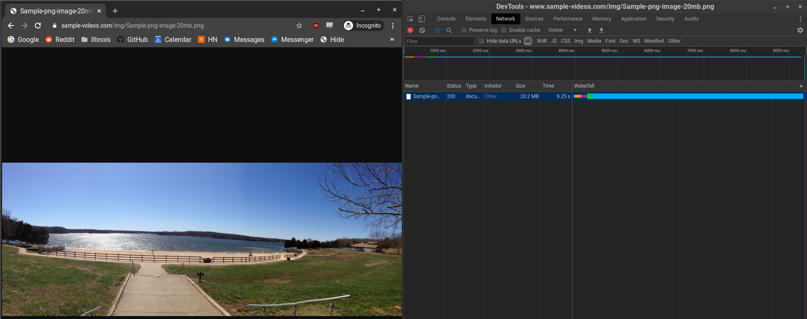
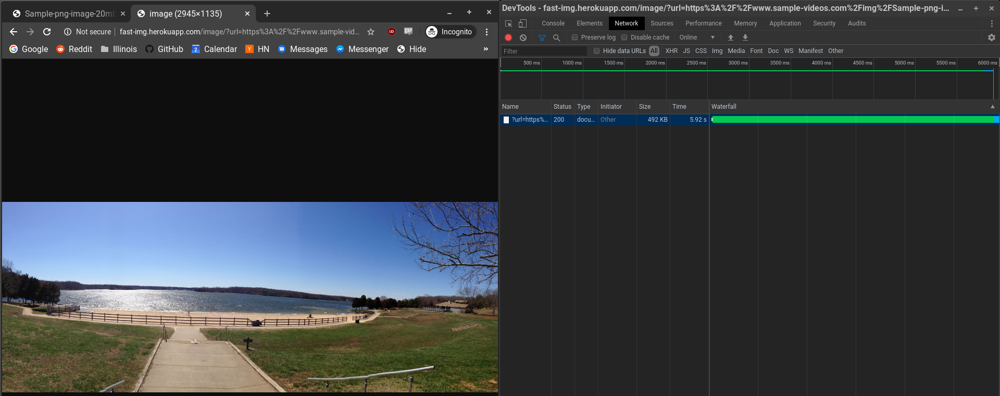
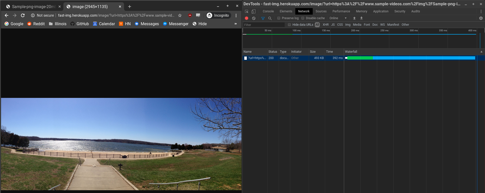
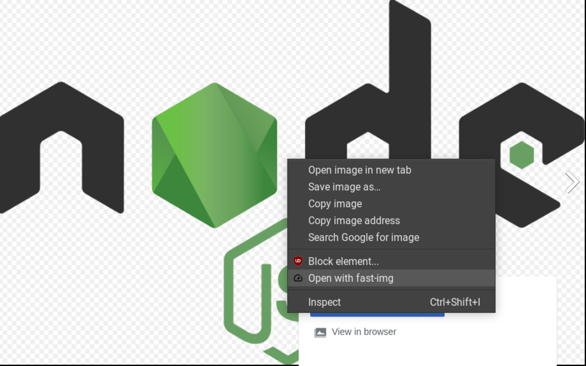

# About 


### Fast-img leans on a data center's fast connection to download, scale and compress an image by URL and then serve back the smaller version in the same request. We also use aggressive caching for repetitive requests. 

It is perfect for use with low bandwidth devices trying to access images at greater speed in exchange for minor quality sacrifices.


This can lead to substantially faster access times for images of all sizes!

# Performance

## 20MB Image w/ ~200Mbps Wifi (9.25s)


## 20MB Image downscaled w/ fast-img (5.92s)
`scale=2, qual=80`



## 20MB Image downscaled w/ fast-img cache hit (0.39s)


# About cont.

The domain takes GET query arguments at `/image/?url=` to a image URL plus optional:
- `qual` [1-100, Default:80]
- `scale` [1-10, Default:2]

We also have the most basic HTML form served at the base domain so you can have the GET query filled out automatically.

The current website has 100Mb reserved for in-memory LRU caching so we can serve duplicate requests at lighting speed.

Be aware that we're using a free dyno on Heroku, so the server goes to sleep after not receiving requests. An initial visit will take a bit of time, but subsequent requests should be very fast!

# Chrome Extension

https://chrome.google.com/webstore/detail/fast-img/incdigmgccieklnojeifgnmfkelgjgne

On images or links ending with `jpeg, jpg, png, svg, gif` we add an addtional ContextMenu (right click option), which opens that image with fast-img in a new tab.




# Setup

Web Server
```
npm install
npm test
npm run start-dev

OR npm run heroku (for heroku testing)
```

Chrome Extension
```
Testing:
Chrome Extensions > Developer Mode [On] >
Load Unpacked Extension > Find the chrome-extension/src folder

To publish:
zip output src/*
```
